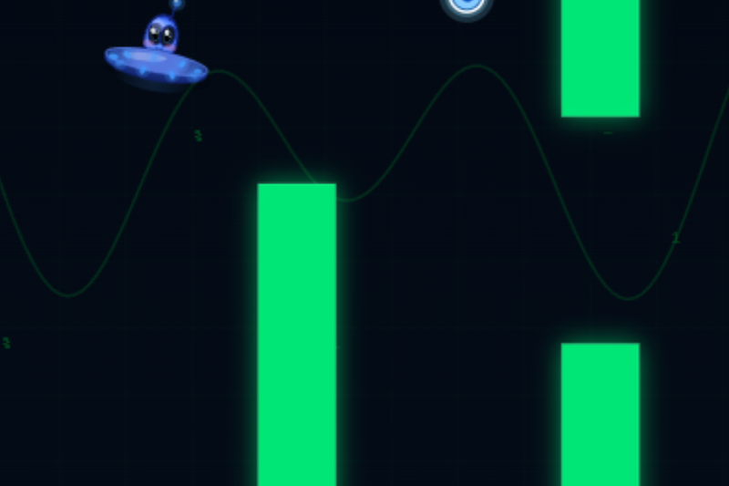
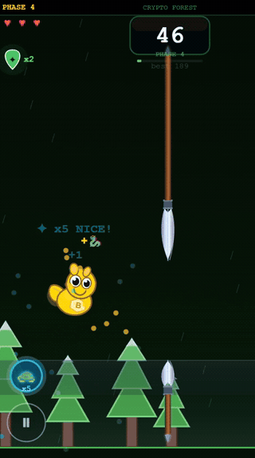

# Flapy Bleu 🎮

> A Flappy Bird-style game deployed on Base Network mainnet — built with AI tools and original art direction.

---

## 🎮 Play Now

👉 **[flapy-bleu.vercel.app](https://flapy-bleu.vercel.app)**

---

## 🌊 About

Flapy Bleu is an onchain-themed arcade game inspired by Flappy Bird.
Built by an AI-powered vibe coder using Claude, Canvas and Suno AI.

The game features original characters, crypto-themed phases, original 
soundtrack, and is integrated with Base Network as a Mini App.

---

## 🗺️ Phases

| Phase | Theme |
|-------|-------|
| 1 | Base Network |
| 2 | Crypto Forest |
| 3 | Volcano |
| 4 | Coming soon... |

---

## ⚙️ Built With

- HTML5 + Canvas
- Suno AI — original soundtrack
- Canvas — character and art direction
- Claude AI — code and logic
- Base Network — Mini App integration
- Vercel — deployment

---

## 🔵 Onchain

Integrated with **Base Network** as a Mini App.
Deployed on mainnet at [flapy-bleu.vercel.app](https://flapy-bleu.vercel.app)

---

## 👤 Author

Built by [@johnlennonferreira](https://github.com/johnlennonferreira)  
Onchain builder | Web3 game builder | AI-powered creator

[LinkedIn](https://www.linkedin.com/in/johnnferreira)
